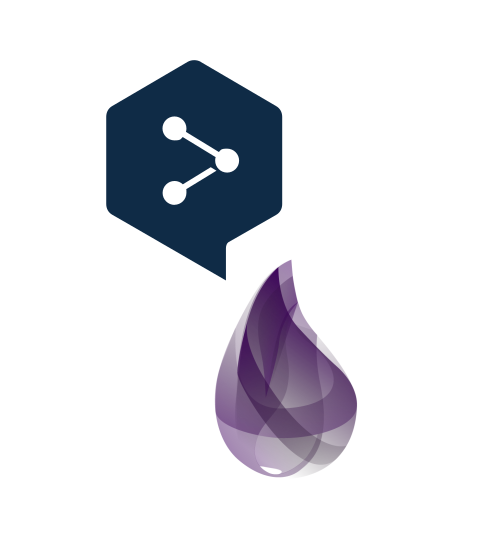

<p align="center">
  <a href="https://hexdocs.pm/deepl" target="_blank">
    
  </a>
</p>

# DeepL

[](https://hex.pm/packages/deepl)
[](https://hex.pm/packages/deepl)
[](https://github.com/muzhawir/deepl/actions/workflows/build.yml)

The [DeepL API](https://www.deepl.com/docs-api) provides a way for programs to send texts and
documents to DeepL's servers and receive high-quality translations and text improvements. This
enables Elixir developers to build a wide range of translation tools using DeepL's leading translation technology.

`deepl` is a **community-maintained** Elixir package for integrating with the DeepL API.

## Requirements

To use `deepl`, your environment must meet these requirements:

- **Erlang**: Version `27.0` or later
- **Elixir**: Version `1.18.0-otp-27` or later

## Installation

To install `deepl`, follow the instructions in the
[Getting Started Guide](https://hexdocs.pm/deepl/getting-started.html).

## Usage

See the [API Reference](https://hexdocs.pm/deepl/api-reference.html) for full examples.
Here are some basics:

**Translate text:**

```elixir
iex> Deepl.Translator.translate("Hello World", "ID")
{:ok,
 %{
   "translations" => [
     %{"detected_source_language" => "EN", "text" => "Halo Dunia"}
   ]
 }}
```

**Rephrase text:**

```elixir
iex> Deepl.Writer.rephrase("this is a example sentence to imprve", "en-US")
{:ok,
 %{
   "improvements" => [
     %{
       "detected_source_language" => "en",
       "target_language" => "en-US",
       "text" => "This is a sample sentence to improve"
     }
   ]
 }}
```

**Get usage and quota:**

```elixir
iex> Deepl.Usage.get()
{:ok,
 %{
   "character_count": 100,
   "character_limit": 500000
 }}
```

## License

This package is licensed under the [MIT License](https://github.com/muzhawir/deepl/blob/main/LICENSE.md).
